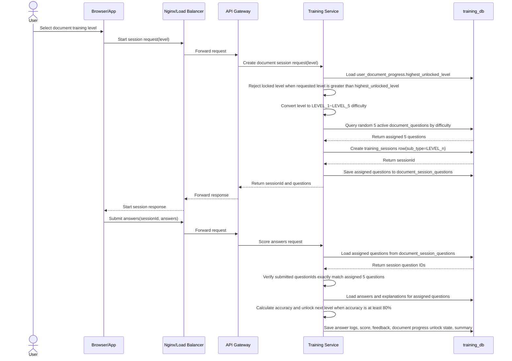

# 시퀀스다이어그램 작성

## 1. 인증 및 사용자 진입

- 1.1 로그인
    
    ```mermaid
    sequenceDiagram
        actor User as 사용자
        participant Browser as Browser/App
        participant Nginx as Nginx/Load Balancer
        participant GW as API Gateway
        participant US as User Service
        participant UDB as user_db
    
        User->>Browser: 아이디/비밀번호 입력
        User->>Browser: 로그인 상태 유지 여부 선택
        Browser->>Browser: 필수 입력값 검증
    
        alt 입력값 누락
            Browser-->>User: 필수 입력 안내
        else 입력값 정상
            Browser->>Nginx: 로그인 요청
            Nginx->>GW: 요청 전달
            GW->>US: 인증 요청
            US->>UDB: 사용자 계정 조회
            UDB-->>US: 계정 정보 반환
    
            alt 계정 없음 또는 비밀번호 불일치
                US->>UDB: 로그인 실패 횟수 증가
                US-->>GW: 실패 응답
                GW-->>Nginx: 실패 응답
                Nginx-->>Browser: 실패 응답
                Browser-->>User: 아이디 또는 비밀번호 불일치 안내
            else 계정 잠금/정지/탈퇴
                US-->>GW: 접근 제한 응답
                GW-->>Nginx: 접근 제한 응답
                Nginx-->>Browser: 접근 제한 응답
                Browser-->>User: 계정 상태 안내
            else 인증 성공
                US->>US: 비밀번호 해시 검증
                US->>US: 토큰/세션 생성
                US->>UDB: 사용자 기본 정보 조회
                UDB-->>US: 사용자 ID, 이름, 이메일, 장애유형, 희망직무 반환
                US->>UDB: 마지막 로그인 시간 갱신
                US-->>GW: 로그인 성공 응답(토큰/세션 + 사용자 기본 정보)
                GW-->>Nginx: 로그인 성공 응답 전달
                Nginx-->>Browser: 로그인 성공 응답(토큰/세션 + 사용자 기본 정보)
                Browser->>Browser: 사용자 기본 정보 저장 또는 상태 반영
                Browser-->>User: 다음 화면 이동
            end
        end
    ```
    
- 1.2 회원가입 및 사용자 정보 입력
    
    ```mermaid
    sequenceDiagram
        actor User as 사용자
        participant Browser as Browser/App
        participant Nginx as Nginx/Load Balancer
        participant GW as API Gateway
        participant US as User Service
        participant UDB as user_db
    
        User->>Browser: 회원가입 화면 진입
        Browser-->>User: 회원가입 및 사용자 정보 입력 폼 표시
     
        User->>Browser: 아이디 입력
        User->>Browser: 비밀번호 입력
        User->>Browser: 이름 입력
        User->>Browser: 생년월일 입력
        User->>Browser: 성별 선택
        User->>Browser: 이메일 입력
        User->>Browser: 장애유형 체크박스 중복 선택
        User->>Browser: 희망직무 입력 또는 선택
        Browser->>Browser: 필수 입력값 및 형식 검증
    
        alt 필수값 누락 또는 입력 형식 오류
            Browser-->>User: 누락/오류 항목 안내
        else 입력값 정상
            Browser->>Nginx: 회원가입 및 사용자 정보 저장 요청
            Nginx->>GW: 요청 전달
            GW->>US: 회원가입 처리 요청
            US->>UDB: 아이디/이메일 중복 확인
            UDB-->>US: 중복 확인 결과 반환
    
            alt 아이디 또는 이메일 중복
                US-->>GW: 중복 오류 응답
                GW-->>Nginx: 중복 오류 응답
                Nginx-->>Browser: 중복 오류 응답
                Browser-->>User: 아이디 또는 이메일 중복 안내
            else 가입 가능
                US->>US: 비밀번호 해시 처리
                US->>UDB: 계정 정보 저장
                US->>UDB: 이름, 생년월일, 성별, 이메일 저장
                US->>UDB: 장애유형 목록 및 희망직무 저장
                UDB-->>US: 저장 완료
                US-->>GW: 회원가입 및 사용자 정보 입력 완료 응답
                GW-->>Nginx: 응답 전달
                Nginx-->>Browser: 완료 응답
                Browser-->>User: 메인 화면 이동
            end
        end
    ```
    
- 1.3 로그아웃
    
    ```mermaid
    sequenceDiagram
        actor User as 사용자
        participant Browser as Browser/App
        participant Nginx as Nginx/Load Balancer
        participant GW as API Gateway
        participant US as User Service
    
        User->>Browser: 로그아웃 버튼 클릭
        Browser->>Nginx: 로그아웃 요청 (Access Token 포함)
        Nginx->>GW: 요청 전달
        GW->>US: 로그아웃 처리 요청
        US->>US: Refresh Token 삭제 또는 만료 처리
        US->>US: 서버 세션 사용 시 세션 종료
        US-->>GW: 로그아웃 완료 응답
        GW-->>Nginx: 응답 전달
        Nginx-->>Browser: 로그아웃 응답
        Browser->>Browser: Access Token 삭제
        Browser->>Browser: Refresh Token 삭제(저장형인 경우)
        Browser-->>User: 로그인 화면으로 이동
    
        alt 이미 만료된 토큰
            US-->>GW: 정상 로그아웃 처리(멱등성)
            GW-->>Nginx: 응답 전달
            Nginx-->>Browser: 성공 응답
        end
    ```
    
- 1.4 내정보 진입
    
    ```mermaid
    sequenceDiagram
        actor User as 사용자
        participant Browser as Browser/App
        participant Nginx as Nginx/Load Balancer
        participant GW as API Gateway
        participant US as User Service
        participant TS as Training Service
        participant UDB as user_db
        participant TDB as training_db
    
        ## 1. 내정보 페이지 진입
        User->>Browser: 내정보 메뉴 선택
        Browser->>Nginx: 내정보 조회 요청
        Nginx->>GW: 요청 전달
        GW->>US: 사용자 기본 정보 조회 요청
        US->>UDB: 사용자 정보 조회
        UDB-->>US: 아이디, 이름, 생년월일, 성별, 이메일, 장애유형, 희망직무 반환
        US-->>GW: 사용자 정보 응답
    
        GW->>TS: 훈련 현황 요약 조회 요청
        TS->>TDB: 사용자 훈련 현황 요약 조회
        TDB-->>TS: 사회성 최근 점수, 안전 정답 수, 문서이해 정답 수, 집중력 현재 단계 반환
        TS-->>GW: 훈련 현황 요약 응답
    
        GW-->>Nginx: 통합 응답 전달
        Nginx-->>Browser: 내정보 응답
        Browser-->>User: 사용자 정보 및 훈련 현황 요약 표시
    
        ## 2. 사용자 정보 수정
        opt 사용자 정보 수정 선택
            User->>Browser: 정보 수정 입력
            Browser->>Nginx: 사용자 정보 수정 요청
            Nginx->>GW: 요청 전달
            GW->>US: 사용자 정보 수정 요청
            US->>UDB: 이름, 이메일, 장애유형, 희망직무 등 수정
            UDB-->>US: 수정 완료
            US-->>GW: 수정 성공 응답
            GW-->>Nginx: 응답 전달
            Nginx-->>Browser: 수정 완료 응답
            Browser-->>User: 수정 완료 안내
        end
    ```
    

## 2. 훈련 선택

- 2.1 훈련 유형 선택
    
    ```mermaid
    sequenceDiagram
        actor User as 사용자
        participant Browser as Browser/App
    
        User->>Browser: 훈련 유형 선택
        Browser->>Browser: 선택한 훈련 페이지로 라우팅
        Browser-->>User: 선택한 훈련 페이지 표시
    ```
    
- 2.2 이번 달 훈련 수준 조회
    
    ```mermaid
    sequenceDiagram
        actor User as 사용자
        participant Browser as Browser/App
        participant Nginx as Nginx/Load Balancer
        participant GW as API Gateway
        participant TS as Training Service
        participant TDB as training_db
    
        ## 1. 훈련 수준 페이지 진입
        User->>Browser: 훈련 수준 메뉴 선택
        Browser->>Nginx: 이번 달 훈련 수준 조회 요청 (기본: SOCIAL)
        Nginx->>GW: 요청 전달
        GW->>TS: GET /api/trainings/progress?type=SOCIAL
        TS->>TS: Asia/Seoul 기준 이번 달 시작/다음 달 시작 계산
        TS->>TDB: training_session_summaries에서 SOCIAL 완료 이력 조회
        TDB-->>TS: 이번 달 완료 수와 점수 반환
        TS->>TS: 최소 완료 수와 평균 점수 기준으로 level/reason/metrics 산정
        TS-->>GW: 공통 훈련 수준 응답
        GW-->>Nginx: 응답 전달
        Nginx-->>Browser: 수준 응답
        Browser-->>User: 사회성 이번 달 훈련 수준 표시

        ## 1-A. 홈 화면 전체 수준 요약 조회
        opt 홈 화면 표시
            Browser->>Nginx: 홈 화면 훈련 수준 요약 조회 요청
            Nginx->>GW: 요청 전달
            GW->>TS: GET /api/trainings/progress/summary
            TS->>TS: Asia/Seoul 기준 이번 달 범위 계산
            loop SOCIAL, SAFETY, DOCUMENT, FOCUS
                TS->>TDB: training_session_summaries 완료 이력 조회
                opt DOCUMENT
                    TS->>TDB: training_sessions.sub_type에서 완료한 최고 LEVEL_n 확인
                end
                TS->>TS: 유형별 규칙으로 level/reason/metrics 산정
            end
            TS-->>GW: 홈 화면 훈련 수준 요약 응답
            GW-->>Nginx: 응답 전달
            Nginx-->>Browser: 요약 응답
            Browser-->>User: 훈련 유형별 성취 레벨 표시
        end
    
        ## 2. 다른 훈련 유형 탭 선택
        opt 훈련 유형 탭 선택
            User->>Browser: 안전/문서 이해/집중력 탭 선택
            Browser->>Nginx: 이번 달 훈련 수준 조회 요청(type=SAFETY|DOCUMENT|FOCUS)
            Nginx->>GW: 요청 전달
            GW->>TS: GET /api/trainings/progress?type={trainingType}
            TS->>TS: Asia/Seoul 기준 이번 달 범위 계산
            TS->>TDB: training_session_summaries 완료 이력 조회
            opt DOCUMENT
                TS->>TDB: training_sessions.sub_type에서 완료한 최고 LEVEL_n 확인
            end
            TS->>TS: 유형별 규칙으로 level/reason/metrics 산정
            TS-->>GW: 공통 훈련 수준 응답
            GW-->>Nginx: 응답 전달
            Nginx-->>Browser: 수준 응답
            Browser-->>User: 선택한 훈련 유형의 이번 달 수준 표시
        end
    
        ## 3. 훈련 기록 목록 조회
        opt 기록 목록 표시
            Browser->>Nginx: 훈련 기록 목록 조회 요청(type, page, size)
            Nginx->>GW: 요청 전달
            GW->>TS: GET /api/trainings/sessions?type={trainingType}&page={page}&size={size}
            TS->>TDB: training_session_summaries 목록 조회
            TDB-->>TS: 완료 세션 요약 목록 반환
            TS-->>GW: 훈련 기록 목록 응답
            GW-->>Nginx: 응답 전달
            Nginx-->>Browser: 목록 응답
            Browser-->>User: 완료 기록 목록 표시
        end
    ```
    

## 3. 사회성 훈련

- 3.1 사회성 훈련
    
    ```mermaid
    sequenceDiagram
        actor User as 사용자
        participant Browser as Browser/App
        participant Nginx as Nginx/Load Balancer
        participant GW as API Gateway
        participant TS as Training Service
        participant VS as Voice Service
        participant OpenAI as OpenAI API
        participant TDB as training_db
        participant EB as Event Broker
        participant RS as Report Service
    
        ## 1. 사회성 훈련 진입
        User->>Browser: 사회성 훈련 선택
        Browser-->>User: 직무 유형 선택 페이지 표시
    
        User->>Browser: 사무직 또는 단순 노무 선택
        Browser->>Nginx: 선택한 직무 유형 전달
        Nginx->>GW: 요청 전달
        GW->>TS: 사회성 훈련 직무 유형 선택 처리 요청
        TS->>TS: 직무 유형 유효성 검증
        TS-->>GW: 시나리오 선택 페이지 이동 정보 반환
        Note over TS,TDB: 직무 유형은 이 시점에 DB에 저장하지 않고, 세션 시작 시 training_sessions.sub_type에 저장한다.
        GW-->>Nginx: 응답 전달
        Nginx-->>Browser: 시나리오 선택 페이지 응답
        Browser-->>User: 선택한 직무 유형에 맞는 시나리오 선택 페이지 표시
    
        User->>Browser: 시나리오 선택
        Browser->>Nginx: 선택한 시나리오 조회 요청
        Nginx->>GW: 요청 전달
        GW->>TS: 시나리오 상세 정보 조회 요청
        TS->>TDB: 선택한 시나리오 ID로 상세 정보 조회
        TDB-->>TS: 시나리오 ID, 상황 설명, 배경 정보, 캐릭터 정보 반환
        TS-->>GW: 시나리오 상세 정보 반환
        GW-->>Nginx: 응답 전달
        Nginx-->>Browser: 시나리오 상세 정보 응답
        Browser-->>User: 시나리오 화면 표시
        Browser-->>User: 상황 설명, 배경 정보, 캐릭터 정보 표시
    
        ## 2. 사회성 훈련 세션 시작
        User->>Browser: 훈련 시작 선택
        Browser->>Nginx: 사회성 훈련 세션 시작 요청(jobType, scenarioId)
        Nginx->>GW: 요청 전달
        GW->>TS: 사회성 훈련 세션 생성 요청
        TS->>TDB: training_sessions 생성(status=IN_PROGRESS, training_type=SOCIAL, sub_type=jobType, scenario_id=scenarioId)
        TDB-->>TS: 세션 ID 반환
        TS-->>GW: 세션 시작 응답(sessionId, scenarioId, status)
        GW-->>Nginx: 응답 전달
        Nginx-->>Browser: 세션 시작 응답
        Browser->>Browser: sessionId 저장
        Browser-->>User: 대화 시작 화면 표시
    
        ## 3. 음성 대화 진행 (반복)
        loop 대화 종료 전까지 반복
            User->>Browser: 음성 대화 진행
            Browser->>Nginx: 음성 처리 요청 (현재 음성 + 이전 대화 맥락 포함 가능)
            Nginx->>GW: 요청 전달
            GW->>VS: 음성/텍스트 변환 및 응답 요청
            VS->>OpenAI: STT 및 AI 응답 생성 요청
            OpenAI-->>VS: 사용자 텍스트 + AI 응답 반환
            VS-->>GW: 결과 반환
            GW-->>Nginx: 결과 반환
            Nginx-->>Browser: 대화 결과 반환
            Browser-->>User: AI 응답 음성/텍스트 표시
            Browser->>Browser: 사용자 발화와 AI 응답을 대화 로그에 로컬 누적
        end
        
        ## 4. 대화 종료 및 데이터 일괄 저장
        User->>Browser: 대화 종료
        Browser->>Nginx: 훈련 종료 및 결과 저장 요청(sessionId, 전체 대화 로그 포함)
        Nginx->>GW: 요청 전달
        GW->>TS: 훈련 종료 처리 요청
        TS->>OpenAI: 상세 피드백 생성 요청 (전체 대화 로그 기반)
        OpenAI-->>TS: AI 피드백 결과 및 훈련 점수 반환
    
        TS->>TDB: 훈련 세션 상태 갱신
        TS->>TDB: 훈련 진행 현황 저장
        TS->>TDB: 전체 대화 로그 저장
        TS->>TDB: AI 피드백 결과 저장
        TS->>TDB: 훈련 점수 저장
        TS->>TDB: 완료 여부 저장
        TDB-->>TS: 저장 완료
    
        TS->>EB: TrainingCompleted 이벤트 발행
        EB-->>RS: 리포트 갱신 이벤트 전달
    
        TS-->>GW: 훈련 종료 및 결과 저장 완료 응답
        GW-->>Nginx: 완료 응답
        Nginx-->>Browser: 결과 화면 데이터 반환
        Browser-->>User: 상세 피드백 및 결과 표시
    ```
    

## 4. 안전 훈련

- 4.1 안전 훈련
    
    ```mermaid
    sequenceDiagram
        actor User as 사용자
        participant Browser as Browser/App
        participant Nginx as Nginx/Load Balancer
        participant GW as API Gateway
        participant TS as Training Service
        participant TDB as training_db
        participant EB as Event Broker
        participant RS as Report Service
    
        ## 1. 안전 훈련 시나리오 선택
        User->>Browser: 안전 훈련 시작
        Browser->>Nginx: 안전 훈련 시나리오 목록 요청
        Nginx->>GW: 요청 전달
        GW->>TS: 안전 훈련 시나리오 목록 조회 요청
        TS->>TDB: 안전 훈련 시나리오 목록 조회
        TDB-->>TS: 시나리오 목록 반환
        TS-->>GW: 시나리오 목록 반환
        GW-->>Nginx: 응답 전달
        Nginx-->>Browser: 시나리오 목록 응답
        Browser-->>User: 안전 훈련 시나리오 선택 페이지 표시
    
        User->>Browser: 시나리오 선택
        Browser->>Nginx: 안전 훈련 세션 시작 및 첫 장면 조회 요청
        Nginx->>GW: 요청 전달
        GW->>TS: 안전 훈련 세션 생성 및 첫 장면 조회 요청
        TS->>TDB: training_sessions 생성(status=IN_PROGRESS, training_type=SAFETY)
        TDB-->>TS: 세션 ID 반환
        TS->>TDB: 선택한 시나리오 ID로 첫 장면 조회
        TDB-->>TS: 화면 정보, 상황 설명, 1차 질문, 1차 선택지 목록 반환
        TS-->>GW: 첫 장면 정보 반환
        GW-->>Nginx: 응답 전달
        Nginx-->>Browser: 첫 장면 정보 응답
        Browser-->>User: 미연시형 안전 훈련 화면 표시
        Browser-->>User: 화면, 상황, 1차 질문, 1차 선택지 표시
    
        ## 2. 선택지 기반 장면 진행 반복
        loop 훈련 종료 장면 전까지
            User->>Browser: 선택지 중 하나 선택
            Browser->>Nginx: 선택 결과 및 현재 장면 ID 제출
            Nginx->>GW: 요청 전달
            GW->>TS: 다음 장면 조회 요청
            TS->>TDB: 선택 결과에 해당하는 다음 장면 조회
            TDB-->>TS: 다음 화면 정보, 다음 상황, 다음 질문, 다음 선택지 반환
            TS->>TDB: safety_action_logs에 선택 이력 즉시 저장
            TS-->>GW: 다음 장면 정보 반환
            GW-->>Nginx: 응답 전달
            Nginx-->>Browser: 다음 장면 정보 응답
            Browser-->>User: 다음 상황과 선택지 표시
        end
    
        ## 3. 안전 훈련 완료 및 결과 저장
        Browser->>Nginx: 안전 훈련 완료 요청
        Nginx->>GW: 요청 전달
        GW->>TS: 안전 훈련 완료 처리 요청
        TS->>TDB: 훈련 세션 상태 갱신(status=COMPLETED, ended_at 기록)
        TS->>TDB: user_safety_progress 갱신
        TS->>TDB: 안전 훈련 결과 및 점수 저장
        TS->>TDB: training_feedbacks 저장
        TS->>TDB: training_session_summaries 생성
        TDB-->>TS: 저장 완료
    
        TS->>EB: TrainingCompleted 이벤트 발행
        EB-->>RS: 리포트 갱신 이벤트 전달
    
        TS-->>GW: 안전 훈련 완료 응답
        GW-->>Nginx: 완료 응답
        Nginx-->>Browser: 결과 화면 데이터 반환
        Browser-->>User: 안전 훈련 결과 및 피드백 표시
    ```
    

## 5. 집중력 훈련

- 5.1 집중력 훈련 (청기백기)
    
    ```mermaid
    sequenceDiagram
        actor User as 사용자
        participant Browser as Browser/App
        participant Nginx as Nginx/Load Balancer
        participant GW as API Gateway
        participant TS as Training Service
        participant TDB as training_db
        participant EB as Event Broker
        participant RS as Report Service
    
        User->>Browser: 청기백기 훈련 시작(원하는 단계 선택)
        Browser->>Nginx: 선택 단계 포함 훈련 시작 요청
        Nginx->>GW: 요청 전달
        GW->>TS: 선택 단계 집중력 훈련 세션 생성 요청
        TS->>TDB: 단계 해금 여부 확인
        TDB-->>TS: 사용 가능 여부 반환
        TS->>TDB: focus_level_rules에서 선택 단계 규칙 조회
        TDB-->>TS: 지시 주기, 제한시간(3분), 지시 복잡도, 해금 기준 정확도 반환
        TS->>TS: 3분치 청기백기 지시 목록 생성
        Note over TS: 지시 ID, 지시 내용, 정답 동작, 표시 시점 포함
        TS->>TDB: 집중력 훈련 세션 생성
        TDB-->>TS: 세션 ID 반환
        TS->>TDB: 생성된 지시 목록 저장
        TDB-->>TS: 저장 완료
        TS-->>GW: 게임 시작 정보 및 지시 목록 반환
        GW-->>Nginx: 응답 전달
        Nginx-->>Browser: 게임 시작 정보 응답
        Browser-->>User: 선택 단계 훈련 시작 화면 표시
    
        loop 제한시간 3분 동안 반복
            Browser->>Browser: 지시 목록의 표시 시점 확인
            Browser-->>User: 음성/텍스트 지시 제공
            User->>Browser: 버튼 또는 터치 반응
            Browser->>Browser: 지시 ID, 사용자 입력, 반응시간 로컬 기록
        end
    
        Browser->>Nginx: 훈련 종료 및 전체 반응 로그 제출
        Nginx->>GW: 요청 전달
        GW->>TS: 전체 반응 로그 채점 및 저장 요청
        TS->>TDB: 세션 지시 목록 조회
        TDB-->>TS: 지시 ID별 정답 동작 반환
        TS->>TS: 정답/오답 및 반응시간 일괄 판정
        TS->>TDB: 지시별 결과 저장(정답/오답/반응시간)
        TDB-->>TS: 저장 완료
        TS->>TS: 정확도 계산
        TS->>TS: 평균 반응속도 계산
        alt 정확도 90% 이상
            TS->>TDB: 다음 단계 해금 처리 (사용자 단계 목록 업데이트)
            TS->>TS: 속도 증가 또는 복합 명령 해금
        else 정확도 90% 미만
            TS->>TS: 현재 선택 단계 유지
        end
    
        TS->>TDB: 결과 저장(정확도, 점수, 단계 결과)
        TS->>EB: TrainingCompleted 이벤트 발행
        EB-->>RS: 리포트 갱신 이벤트 전달
        TS-->>GW: 최종 결과 반환
        GW-->>Nginx: 응답 전달
        Nginx-->>Browser: 결과 응답
        Browser-->>User: 정확도, 오답 수, 새로 해금된 단계 여부 표시
    ```
    

## 6. 문서 이해 훈련

- 6.1 문서 이해 훈련
    
    ```mermaid
    sequenceDiagram
        actor User as 사용자
        participant Browser as Browser/App
        participant Nginx as Nginx/Load Balancer
        participant GW as API Gateway
        participant TS as Training Service
        participant TDB as training_db
        participant EB as Event Broker
        participant RS as Report Service
    
    		User->>Browser: 문서 이해 훈련 시작
    		Browser->>Nginx: 문서 이해 훈련 세션 시작 요청
    		Nginx->>GW: 요청 전달
    		GW->>TS: 문서 이해 훈련 세션 생성 요청
    		TS->>TDB: 문서 이해 훈련 세션 생성
    		TDB-->>TS: 세션 ID 반환
    		TS->>TDB: 활성 문서 이해 문제 목록 및 첫 문제 조회
    		TDB-->>TS: 문서/대화/안내문, 질문, 선택지 또는 정답 기준 반환
        TS-->>GW: 훈련 시작 정보 반환
        GW-->>Nginx: 응답 전달
        Nginx-->>Browser: 훈련 시작 정보 응답
        Browser-->>User: 짧은 문서 또는 대화와 문제 표시
    
        User->>Browser: 문제 풀이 후 정답 제출
        Browser->>Nginx: 답변 제출 요청
        Nginx->>GW: 요청 전달
        GW->>TS: 답변 채점 요청
        TS->>TDB: 정답 및 해설 조회
        TDB-->>TS: 정답/핵심 이해 포인트/해설 반환
        TS->>TS: 정답 여부 및 점수 계산
        TS->>TDB: 풀이 결과와 피드백 저장
        TS-->>GW: 채점 결과 반환
        GW-->>Nginx: 응답 전달
        Nginx-->>Browser: 채점 결과 응답
        Browser-->>User: 정답 여부와 피드백 표시
    
        opt 문서 이해 훈련 종료
            TS->>TDB: 전체 수행 결과 저장
            TS->>EB: TrainingCompleted 이벤트 발행
            EB-->>RS: 리포트 갱신 이벤트 전달
        end
    ```
    

## 7. 리포트

- 7.1 리포트
    
    ```mermaid
    sequenceDiagram
        actor User as 사용자
        participant Browser as Browser/App
        participant Nginx as Nginx/Load Balancer
        participant GW as API Gateway
        participant RS as Report Service
        participant RDB as report_db
        participant TS as Training Service
        participant EB as Event Broker
    
        User->>Browser: 리포트 화면 진입
        Browser->>Nginx: 리포트 조회 요청
        Nginx->>GW: 요청 전달
        GW->>RS: 사용자 리포트 조회
        RS->>RDB: 훈련 이수 현황, 영역별 점수, 직무 준비도, 종합 코멘트 조회
        RDB-->>RS: 리포트 데이터 반환
        RS-->>GW: 리포트 응답
        GW-->>Nginx: 응답 전달
        Nginx-->>Browser: 리포트 응답
        Browser-->>User: 훈련 현황, 역량 차트, 직무 준비도, 종합 코멘트 표시
    
        opt 훈련 완료 시 자동 갱신
            TS->>EB: TrainingCompleted 이벤트 발행
            EB-->>RS: TrainingCompleted 이벤트 전달
            RS->>RS: 훈련 유형별 점수 재계산
            RS->>RS: 최근 수행 기록 반영
            RS->>RS: 직무 준비도 재산정
            RS->>RDB: 리포트 데이터 갱신 저장
        end
    
        alt 리포트 데이터가 없거나 최신 훈련 결과와 불일치
            RS->>TS: 사용자 최신 훈련 결과 재조회 요청
            TS-->>RS: 최신 훈련 완료 이력, 점수, 피드백 요약 반환
            RS->>RS: 최신 훈련 결과 기반 리포트 재계산
            RS->>RDB: 재계산된 리포트 데이터 저장
        end
    ```

## 8. Document Training Level Assignment Addendum


