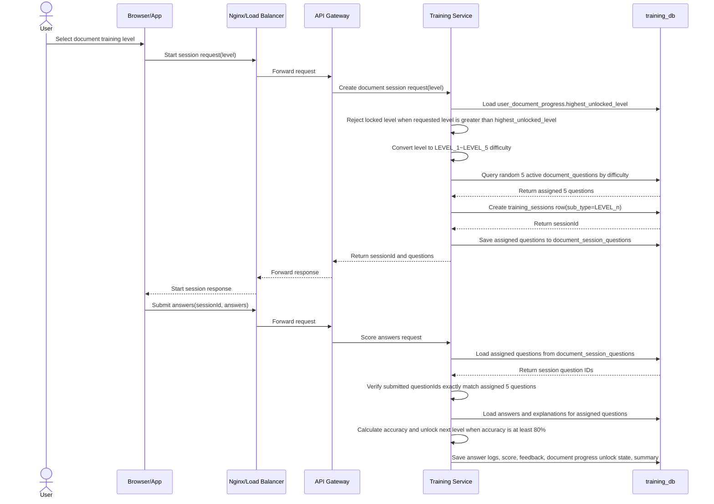

# ?쒗€€?ㅻ떎?댁뼱洹몃옩 ?묒꽦

## 1. ?몄쬆 諛??ъ슜??吏꾩엯

- 1.1 濡쒓렇??
    
    ```mermaid
    sequenceDiagram
        actor User as ?ъ슜??
        participant Browser as Browser/App
        participant Nginx as Nginx/Load Balancer
        participant GW as API Gateway
        participant US as User Service
        participant UDB as user_db
    
        User->>Browser: ?꾩씠??鍮꾨?踰덊샇 ?낅젰
        User->>Browser: 濡쒓렇???곹깭 ?좎? ?щ? ?좏깮
        Browser->>Browser: ?꾩닔 ?낅젰媛?寃€利?
    
        alt ?낅젰媛??꾨씫
            Browser-->>User: ?꾩닔 ?낅젰 ?덈궡
        else ?낅젰媛??뺤긽
            Browser->>Nginx: 濡쒓렇???붿껌
            Nginx->>GW: ?붿껌 ?꾨떖
            GW->>US: ?몄쬆 ?붿껌
            US->>UDB: ?ъ슜??怨꾩젙 議고쉶
            UDB-->>US: 怨꾩젙 ?뺣낫 諛섑솚
    
            alt 怨꾩젙 ?놁쓬 ?먮뒗 鍮꾨?踰덊샇 遺덉씪移?
                US->>UDB: 濡쒓렇???ㅽ뙣 ?잛닔 利앷?
                US-->>GW: ?ㅽ뙣 ?묐떟
                GW-->>Nginx: ?ㅽ뙣 ?묐떟
                Nginx-->>Browser: ?ㅽ뙣 ?묐떟
                Browser-->>User: ?꾩씠???먮뒗 鍮꾨?踰덊샇 遺덉씪移??덈궡
            else 怨꾩젙 ?좉툑/?뺤?/?덊눜
                US-->>GW: ?묎렐 ?쒗븳 ?묐떟
                GW-->>Nginx: ?묎렐 ?쒗븳 ?묐떟
                Nginx-->>Browser: ?묎렐 ?쒗븳 ?묐떟
                Browser-->>User: 怨꾩젙 ?곹깭 ?덈궡
            else ?몄쬆 ?깃났
                US->>US: 鍮꾨?踰덊샇 ?댁떆 寃€利?
                US->>US: ?좏겙/?몄뀡 ?앹꽦
                US->>UDB: ?ъ슜??湲곕낯 ?뺣낫 議고쉶
                UDB-->>US: ?ъ슜??ID, ?대쫫, ?대찓?? ?μ븷?좏삎, ?щ쭩吏곷Т 諛섑솚
                US->>UDB: 留덉?留?濡쒓렇???쒓컙 媛깆떊
                US-->>GW: 濡쒓렇???깃났 ?묐떟(?좏겙/?몄뀡 + ?ъ슜??湲곕낯 ?뺣낫)
                GW-->>Nginx: 濡쒓렇???깃났 ?묐떟 ?꾨떖
                Nginx-->>Browser: 濡쒓렇???깃났 ?묐떟(?좏겙/?몄뀡 + ?ъ슜??湲곕낯 ?뺣낫)
                Browser->>Browser: ?ъ슜??湲곕낯 ?뺣낫 ?€???먮뒗 ?곹깭 諛섏쁺
                Browser-->>User: ?ㅼ쓬 ?붾㈃ ?대룞
            end
        end
    ```
    
- 1.2 ?뚯썝媛€??諛??ъ슜???뺣낫 ?낅젰
    
    ```mermaid
    sequenceDiagram
        actor User as ?ъ슜??
        participant Browser as Browser/App
        participant Nginx as Nginx/Load Balancer
        participant GW as API Gateway
        participant US as User Service
        participant UDB as user_db
    
        User->>Browser: ?뚯썝媛€???붾㈃ 吏꾩엯
        Browser-->>User: ?뚯썝媛€??諛??ъ슜???뺣낫 ?낅젰 ???쒖떆
     
        User->>Browser: ?꾩씠???낅젰
        User->>Browser: 鍮꾨?踰덊샇 ?낅젰
        User->>Browser: ?대쫫 ?낅젰
        User->>Browser: ?앸뀈?붿씪 ?낅젰
        User->>Browser: ?깅퀎 ?좏깮
        User->>Browser: ?대찓???낅젰
        User->>Browser: ?μ븷?좏삎 泥댄겕諛뺤뒪 以묐났 ?좏깮
        User->>Browser: ?щ쭩吏곷Т ?낅젰 ?먮뒗 ?좏깮
        Browser->>Browser: ?꾩닔 ?낅젰媛?諛??뺤떇 寃€利?
    
        alt ?꾩닔媛??꾨씫 ?먮뒗 ?낅젰 ?뺤떇 ?ㅻ쪟
            Browser-->>User: ?꾨씫/?ㅻ쪟 ??ぉ ?덈궡
        else ?낅젰媛??뺤긽
            Browser->>Nginx: ?뚯썝媛€??諛??ъ슜???뺣낫 ?€???붿껌
            Nginx->>GW: ?붿껌 ?꾨떖
            GW->>US: ?뚯썝媛€??泥섎━ ?붿껌
            US->>UDB: ?꾩씠???대찓??以묐났 ?뺤씤
            UDB-->>US: 以묐났 ?뺤씤 寃곌낵 諛섑솚
    
            alt ?꾩씠???먮뒗 ?대찓??以묐났
                US-->>GW: 以묐났 ?ㅻ쪟 ?묐떟
                GW-->>Nginx: 以묐났 ?ㅻ쪟 ?묐떟
                Nginx-->>Browser: 以묐났 ?ㅻ쪟 ?묐떟
                Browser-->>User: ?꾩씠???먮뒗 ?대찓??以묐났 ?덈궡
            else 媛€??媛€??
                US->>US: 鍮꾨?踰덊샇 ?댁떆 泥섎━
                US->>UDB: 怨꾩젙 ?뺣낫 ?€??
                US->>UDB: ?대쫫, ?앸뀈?붿씪, ?깅퀎, ?대찓???€??
                US->>UDB: ?μ븷?좏삎 紐⑸줉 諛??щ쭩吏곷Т ?€??
                UDB-->>US: ?€???꾨즺
                US-->>GW: ?뚯썝媛€??諛??ъ슜???뺣낫 ?낅젰 ?꾨즺 ?묐떟
                GW-->>Nginx: ?묐떟 ?꾨떖
                Nginx-->>Browser: ?꾨즺 ?묐떟
                Browser-->>User: 硫붿씤 ?붾㈃ ?대룞
            end
        end
    ```
    
- 1.3 濡쒓렇?꾩썐
    
    ```mermaid
    sequenceDiagram
        actor User as ?ъ슜??
        participant Browser as Browser/App
        participant Nginx as Nginx/Load Balancer
        participant GW as API Gateway
        participant US as User Service
    
        User->>Browser: 濡쒓렇?꾩썐 踰꾪듉 ?대┃
        Browser->>Nginx: 濡쒓렇?꾩썐 ?붿껌 (Access Token ?ы븿)
        Nginx->>GW: ?붿껌 ?꾨떖
        GW->>US: 濡쒓렇?꾩썐 泥섎━ ?붿껌
        US->>US: Refresh Token ??젣 ?먮뒗 留뚮즺 泥섎━
        US->>US: ?쒕쾭 ?몄뀡 ?ъ슜 ???몄뀡 醫낅즺
        US-->>GW: 濡쒓렇?꾩썐 ?꾨즺 ?묐떟
        GW-->>Nginx: ?묐떟 ?꾨떖
        Nginx-->>Browser: 濡쒓렇?꾩썐 ?묐떟
        Browser->>Browser: Access Token ??젣
        Browser->>Browser: Refresh Token ??젣(?€?ν삎??寃쎌슦)
        Browser-->>User: 濡쒓렇???붾㈃?쇰줈 ?대룞
    
        alt ?대? 留뚮즺???좏겙
            US-->>GW: ?뺤긽 濡쒓렇?꾩썐 泥섎━(硫깅벑??
            GW-->>Nginx: ?묐떟 ?꾨떖
            Nginx-->>Browser: ?깃났 ?묐떟
        end
    ```
    
- 1.4 ?댁젙蹂?吏꾩엯
    
    ```mermaid
    sequenceDiagram
        actor User as ?ъ슜??
        participant Browser as Browser/App
        participant Nginx as Nginx/Load Balancer
        participant GW as API Gateway
        participant US as User Service
        participant TS as Training Service
        participant UDB as user_db
        participant TDB as training_db
    
        ## 1. ?댁젙蹂??섏씠吏€ 吏꾩엯
        User->>Browser: ?댁젙蹂?硫붾돱 ?좏깮
        Browser->>Nginx: ?댁젙蹂?議고쉶 ?붿껌
        Nginx->>GW: ?붿껌 ?꾨떖
        GW->>US: ?ъ슜??湲곕낯 ?뺣낫 議고쉶 ?붿껌
        US->>UDB: ?ъ슜???뺣낫 議고쉶
        UDB-->>US: ?꾩씠?? ?대쫫, ?앸뀈?붿씪, ?깅퀎, ?대찓?? ?μ븷?좏삎, ?щ쭩吏곷Т 諛섑솚
        US-->>GW: ?ъ슜???뺣낫 ?묐떟
    
        GW->>TS: ?덈젴 ?꾪솴 ?붿빟 議고쉶 ?붿껌
        TS->>TDB: ?ъ슜???덈젴 ?꾪솴 ?붿빟 議고쉶
        TDB-->>TS: ?ы쉶??理쒓렐 ?먯닔, ?덉쟾 ?뺣떟 ?? 臾몄꽌?댄빐 ?뺣떟 ?? 吏묒쨷???꾩옱 ?④퀎 諛섑솚
        TS-->>GW: ?덈젴 ?꾪솴 ?붿빟 ?묐떟
    
        GW-->>Nginx: ?듯빀 ?묐떟 ?꾨떖
        Nginx-->>Browser: ?댁젙蹂??묐떟
        Browser-->>User: ?ъ슜???뺣낫 諛??덈젴 ?꾪솴 ?붿빟 ?쒖떆
    
        ## 2. ?ъ슜???뺣낫 ?섏젙
        opt ?ъ슜???뺣낫 ?섏젙 ?좏깮
            User->>Browser: ?뺣낫 ?섏젙 ?낅젰
            Browser->>Nginx: ?ъ슜???뺣낫 ?섏젙 ?붿껌
            Nginx->>GW: ?붿껌 ?꾨떖
            GW->>US: ?ъ슜???뺣낫 ?섏젙 ?붿껌
            US->>UDB: ?대쫫, ?대찓?? ?μ븷?좏삎, ?щ쭩吏곷Т ???섏젙
            UDB-->>US: ?섏젙 ?꾨즺
            US-->>GW: ?섏젙 ?깃났 ?묐떟
            GW-->>Nginx: ?묐떟 ?꾨떖
            Nginx-->>Browser: ?섏젙 ?꾨즺 ?묐떟
            Browser-->>User: ?섏젙 ?꾨즺 ?덈궡
        end
    ```
    

## 2. ?덈젴 ?좏깮

- 2.1 ?덈젴 ?좏삎 ?좏깮
    
    ```mermaid
    sequenceDiagram
        actor User as ?ъ슜??
        participant Browser as Browser/App
    
        User->>Browser: ?덈젴 ?좏삎 ?좏깮
        Browser->>Browser: ?좏깮???덈젴 ?섏씠吏€濡??쇱슦??
        Browser-->>User: ?좏깮???덈젴 ?섏씠吏€ ?쒖떆
    ```
    
- 2.2 ?대쾲 ???덈젴 ?섏? 議고쉶
    
    ```mermaid
    sequenceDiagram
        actor User as ?ъ슜??
        participant Browser as Browser/App
        participant Nginx as Nginx/Load Balancer
        participant GW as API Gateway
        participant TS as Training Service
        participant TDB as training_db
    
        ## 1. ?덈젴 ?섏? ?섏씠吏€ 吏꾩엯
        User->>Browser: ?덈젴 ?섏? 硫붾돱 ?좏깮
        Browser->>Nginx: ?대쾲 ???덈젴 ?섏? 議고쉶 ?붿껌 (湲곕낯: SOCIAL)
        Nginx->>GW: ?붿껌 ?꾨떖
        GW->>TS: GET /api/trainings/progress?type=SOCIAL
        TS->>TS: Asia/Seoul 湲곗? ?대쾲 ???쒖옉/?ㅼ쓬 ???쒖옉 怨꾩궛
        TS->>TDB: training_session_summaries?먯꽌 SOCIAL ?꾨즺 ?대젰 議고쉶
        TDB-->>TS: ?대쾲 ???꾨즺 ?섏? ?먯닔 諛섑솚
        TS->>TS: 理쒖냼 ?꾨즺 ?섏? ?됯퇏 ?먯닔 湲곗??쇰줈 level/reason/metrics ?곗젙
        TS-->>GW: 怨듯넻 ?덈젴 ?섏? ?묐떟
        GW-->>Nginx: ?묐떟 ?꾨떖
        Nginx-->>Browser: ?섏? ?묐떟
        Browser-->>User: ?ы쉶???대쾲 ???덈젴 ?섏? ?쒖떆

        ## 1-A. ???붾㈃ ?꾩껜 ?섏? ?붿빟 議고쉶
        opt ???붾㈃ ?쒖떆
            Browser->>Nginx: ???붾㈃ ?덈젴 ?섏? ?붿빟 議고쉶 ?붿껌
            Nginx->>GW: ?붿껌 ?꾨떖
            GW->>TS: GET /api/trainings/progress/summary
            TS->>TS: Asia/Seoul 湲곗? ?대쾲 ??踰붿쐞 怨꾩궛
            loop SOCIAL, SAFETY, DOCUMENT, FOCUS
                TS->>TDB: training_session_summaries ?꾨즺 ?대젰 議고쉶
                opt DOCUMENT
                    TS->>TDB: training_sessions.sub_type?먯꽌 ?꾨즺??理쒓퀬 LEVEL_n ?뺤씤
                end
                TS->>TS: ?좏삎蹂?洹쒖튃?쇰줈 level/reason/metrics ?곗젙
            end
            TS-->>GW: ???붾㈃ ?덈젴 ?섏? ?붿빟 ?묐떟
            GW-->>Nginx: ?묐떟 ?꾨떖
            Nginx-->>Browser: ?붿빟 ?묐떟
            Browser-->>User: ?덈젴 ?좏삎蹂??깆랬 ?덈꺼 ?쒖떆
        end
    
        ## 2. ?ㅻⅨ ?덈젴 ?좏삎 ???좏깮
        opt ?덈젴 ?좏삎 ???좏깮
            User->>Browser: ?덉쟾/臾몄꽌 ?댄빐/吏묒쨷?????좏깮
            Browser->>Nginx: ?대쾲 ???덈젴 ?섏? 議고쉶 ?붿껌(type=SAFETY|DOCUMENT|FOCUS)
            Nginx->>GW: ?붿껌 ?꾨떖
            GW->>TS: GET /api/trainings/progress?type={trainingType}
            TS->>TS: Asia/Seoul 湲곗? ?대쾲 ??踰붿쐞 怨꾩궛
            TS->>TDB: training_session_summaries ?꾨즺 ?대젰 議고쉶
            opt DOCUMENT
                TS->>TDB: training_sessions.sub_type?먯꽌 ?꾨즺??理쒓퀬 LEVEL_n ?뺤씤
            end
            TS->>TS: ?좏삎蹂?洹쒖튃?쇰줈 level/reason/metrics ?곗젙
            TS-->>GW: 怨듯넻 ?덈젴 ?섏? ?묐떟
            GW-->>Nginx: ?묐떟 ?꾨떖
            Nginx-->>Browser: ?섏? ?묐떟
            Browser-->>User: ?좏깮???덈젴 ?좏삎???대쾲 ???섏? ?쒖떆
        end
    
        ## 3. ?덈젴 湲곕줉 紐⑸줉 議고쉶
        opt 湲곕줉 紐⑸줉 ?쒖떆
            Browser->>Nginx: ?덈젴 湲곕줉 紐⑸줉 議고쉶 ?붿껌(type, page, size)
            Nginx->>GW: ?붿껌 ?꾨떖
            GW->>TS: GET /api/trainings/sessions?type={trainingType}&page={page}&size={size}
            TS->>TDB: training_session_summaries 紐⑸줉 議고쉶
            TDB-->>TS: ?꾨즺 ?몄뀡 ?붿빟 紐⑸줉 諛섑솚
            TS-->>GW: ?덈젴 湲곕줉 紐⑸줉 ?묐떟
            GW-->>Nginx: ?묐떟 ?꾨떖
            Nginx-->>Browser: 紐⑸줉 ?묐떟
            Browser-->>User: ?꾨즺 湲곕줉 紐⑸줉 ?쒖떆
        end
    ```
    

## 3. ?ы쉶???덈젴

- 3.1 ?ы쉶???덈젴
    
    ```mermaid
    sequenceDiagram
        actor User as ?ъ슜??
        participant Browser as Browser/App
        participant Nginx as Nginx/Load Balancer
        participant GW as API Gateway
        participant TS as Training Service
        participant VS as Voice Service
        participant OpenAI as OpenAI API
        participant TDB as training_db
        participant EB as Event Broker
        participant RS as Report Service
    
        ## 1. ?ы쉶???덈젴 吏꾩엯
        User->>Browser: ?ы쉶???덈젴 ?좏깮
        Browser-->>User: 吏곷Т ?좏삎 ?좏깮 ?섏씠吏€ ?쒖떆
    
        User->>Browser: ?щТ吏??먮뒗 ?⑥닚 ?몃Т ?좏깮
        Browser->>Nginx: ?좏깮??吏곷Т ?좏삎 ?꾨떖
        Nginx->>GW: ?붿껌 ?꾨떖
        GW->>TS: ?ы쉶???덈젴 吏곷Т ?좏삎 ?좏깮 泥섎━ ?붿껌
        TS->>TS: 吏곷Т ?좏삎 ?좏슚??寃€利?
        TS-->>GW: ?쒕굹由ъ삤 ?좏깮 ?섏씠吏€ ?대룞 ?뺣낫 諛섑솚
        Note over TS,TDB: 吏곷Т ?좏삎?€ ???쒖젏??DB???€?ν븯吏€ ?딄퀬, ?몄뀡 ?쒖옉 ??training_sessions.sub_type???€?ν븳??
        GW-->>Nginx: ?묐떟 ?꾨떖
        Nginx-->>Browser: ?쒕굹由ъ삤 ?좏깮 ?섏씠吏€ ?묐떟
        Browser-->>User: ?좏깮??吏곷Т ?좏삎??留욌뒗 ?쒕굹由ъ삤 ?좏깮 ?섏씠吏€ ?쒖떆
    
        User->>Browser: ?쒕굹由ъ삤 ?좏깮
        Browser->>Nginx: ?좏깮???쒕굹由ъ삤 議고쉶 ?붿껌
        Nginx->>GW: ?붿껌 ?꾨떖
        GW->>TS: ?쒕굹由ъ삤 ?곸꽭 ?뺣낫 議고쉶 ?붿껌
        TS->>TDB: ?좏깮???쒕굹由ъ삤 ID濡??곸꽭 ?뺣낫 議고쉶
        TDB-->>TS: ?쒕굹由ъ삤 ID, ?곹솴 ?ㅻ챸, 諛곌꼍 ?뺣낫, 罹먮┃???뺣낫 諛섑솚
        TS-->>GW: ?쒕굹由ъ삤 ?곸꽭 ?뺣낫 諛섑솚
        GW-->>Nginx: ?묐떟 ?꾨떖
        Nginx-->>Browser: ?쒕굹由ъ삤 ?곸꽭 ?뺣낫 ?묐떟
        Browser-->>User: ?쒕굹由ъ삤 ?붾㈃ ?쒖떆
        Browser-->>User: ?곹솴 ?ㅻ챸, 諛곌꼍 ?뺣낫, 罹먮┃???뺣낫 ?쒖떆
    
        ## 2. ?ы쉶???덈젴 ?몄뀡 ?쒖옉
        User->>Browser: ?덈젴 ?쒖옉 ?좏깮
        Browser->>Nginx: ?ы쉶???덈젴 ?몄뀡 ?쒖옉 ?붿껌(jobType, scenarioId)
        Nginx->>GW: ?붿껌 ?꾨떖
        GW->>TS: ?ы쉶???덈젴 ?몄뀡 ?앹꽦 ?붿껌
        TS->>TDB: training_sessions ?앹꽦(status=IN_PROGRESS, training_type=SOCIAL, sub_type=jobType, scenario_id=scenarioId)
        TDB-->>TS: ?몄뀡 ID 諛섑솚
        TS-->>GW: ?몄뀡 ?쒖옉 ?묐떟(sessionId, scenarioId, status)
        GW-->>Nginx: ?묐떟 ?꾨떖
        Nginx-->>Browser: ?몄뀡 ?쒖옉 ?묐떟
        Browser->>Browser: sessionId ?€??
        Browser-->>User: ?€???쒖옉 ?붾㈃ ?쒖떆
    
        ## 3. ?뚯꽦 ?€??吏꾪뻾 (諛섎났)
        loop ?€??醫낅즺 ?꾧퉴吏€ 諛섎났
            User->>Browser: ?뚯꽦 ?€??吏꾪뻾
            Browser->>Nginx: ?뚯꽦 泥섎━ ?붿껌 (?꾩옱 ?뚯꽦 + ?댁쟾 ?€??留λ씫 ?ы븿 媛€??
            Nginx->>GW: ?붿껌 ?꾨떖
            GW->>VS: ?뚯꽦/?띿뒪??蹂€??諛??묐떟 ?붿껌
            VS->>OpenAI: STT 諛?AI ?묐떟 ?앹꽦 ?붿껌
            OpenAI-->>VS: ?ъ슜???띿뒪??+ AI ?묐떟 諛섑솚
            VS-->>GW: 寃곌낵 諛섑솚
            GW-->>Nginx: 寃곌낵 諛섑솚
            Nginx-->>Browser: ?€??寃곌낵 諛섑솚
            Browser-->>User: AI ?묐떟 ?뚯꽦/?띿뒪???쒖떆
            Browser->>Browser: ?ъ슜??諛쒗솕?€ AI ?묐떟???€??濡쒓렇??濡쒖뺄 ?꾩쟻
        end
        
        ## 4. ?€??醫낅즺 諛??곗씠???쇨큵 ?€??
        User->>Browser: ?€??醫낅즺
        Browser->>Nginx: ?덈젴 醫낅즺 諛?寃곌낵 ?€???붿껌(sessionId, ?꾩껜 ?€??濡쒓렇 ?ы븿)
        Nginx->>GW: ?붿껌 ?꾨떖
        GW->>TS: ?덈젴 醫낅즺 泥섎━ ?붿껌
        TS->>OpenAI: ?곸꽭 ?쇰뱶諛??앹꽦 ?붿껌 (?꾩껜 ?€??濡쒓렇 湲곕컲)
        OpenAI-->>TS: AI ?쇰뱶諛?寃곌낵 諛??덈젴 ?먯닔 諛섑솚
    
        TS->>TDB: ?덈젴 ?몄뀡 ?곹깭 媛깆떊
        TS->>TDB: ?덈젴 吏꾪뻾 ?꾪솴 ?€??
        TS->>TDB: ?꾩껜 ?€??濡쒓렇 ?€??
        TS->>TDB: AI ?쇰뱶諛?寃곌낵 ?€??
        TS->>TDB: ?덈젴 ?먯닔 ?€??
        TS->>TDB: ?꾨즺 ?щ? ?€??
        TDB-->>TS: ?€???꾨즺
    
        TS->>EB: TrainingCompleted ?대깽??諛쒗뻾
        EB-->>RS: 由ы룷??媛깆떊 ?대깽???꾨떖
    
        TS-->>GW: ?덈젴 醫낅즺 諛?寃곌낵 ?€???꾨즺 ?묐떟
        GW-->>Nginx: ?꾨즺 ?묐떟
        Nginx-->>Browser: 寃곌낵 ?붾㈃ ?곗씠??諛섑솚
        Browser-->>User: ?곸꽭 ?쇰뱶諛?諛?寃곌낵 ?쒖떆
    ```
    

## 4. ?덉쟾 ?덈젴

- 4.1 ?덉쟾 ?덈젴
    
    ```mermaid
    sequenceDiagram
        actor User as ?ъ슜??
        participant Browser as Browser/App
        participant Nginx as Nginx/Load Balancer
        participant GW as API Gateway
        participant TS as Training Service
        participant TDB as training_db
        participant EB as Event Broker
        participant RS as Report Service
    
        ## 1. ?덉쟾 ?덈젴 ?쒕굹由ъ삤 ?좏깮
        User->>Browser: ?덉쟾 ?덈젴 ?쒖옉
        Browser->>Nginx: ?덉쟾 ?덈젴 ?쒕굹由ъ삤 紐⑸줉 ?붿껌
        Nginx->>GW: ?붿껌 ?꾨떖
        GW->>TS: ?덉쟾 ?덈젴 ?쒕굹由ъ삤 紐⑸줉 議고쉶 ?붿껌
        TS->>TDB: ?덉쟾 ?덈젴 ?쒕굹由ъ삤 紐⑸줉 議고쉶
        TDB-->>TS: ?쒕굹由ъ삤 紐⑸줉 諛섑솚
        TS-->>GW: ?쒕굹由ъ삤 紐⑸줉 諛섑솚
        GW-->>Nginx: ?묐떟 ?꾨떖
        Nginx-->>Browser: ?쒕굹由ъ삤 紐⑸줉 ?묐떟
        Browser-->>User: ?덉쟾 ?덈젴 ?쒕굹由ъ삤 ?좏깮 ?섏씠吏€ ?쒖떆
    
        User->>Browser: ?쒕굹由ъ삤 ?좏깮
        Browser->>Nginx: ?덉쟾 ?덈젴 ?몄뀡 ?쒖옉 諛?泥??λ㈃ 議고쉶 ?붿껌
        Nginx->>GW: ?붿껌 ?꾨떖
        GW->>TS: ?덉쟾 ?덈젴 ?몄뀡 ?앹꽦 諛?泥??λ㈃ 議고쉶 ?붿껌
        TS->>TDB: training_sessions ?앹꽦(status=IN_PROGRESS, training_type=SAFETY)
        TDB-->>TS: ?몄뀡 ID 諛섑솚
        TS->>TDB: ?좏깮???쒕굹由ъ삤 ID濡?泥??λ㈃ 議고쉶
        TDB-->>TS: ?붾㈃ ?뺣낫, ?곹솴 ?ㅻ챸, 1李?吏덈Ц, 1李??좏깮吏€ 紐⑸줉 諛섑솚
        TS-->>GW: 泥??λ㈃ ?뺣낫 諛섑솚
        GW-->>Nginx: ?묐떟 ?꾨떖
        Nginx-->>Browser: 泥??λ㈃ ?뺣낫 ?묐떟
        Browser-->>User: 誘몄뿰?쒗삎 ?덉쟾 ?덈젴 ?붾㈃ ?쒖떆
        Browser-->>User: ?붾㈃, ?곹솴, 1李?吏덈Ц, 1李??좏깮吏€ ?쒖떆
    
        ## 2. ?좏깮吏€ 湲곕컲 ?λ㈃ 吏꾪뻾 諛섎났
        loop ?덈젴 醫낅즺 ?λ㈃ ?꾧퉴吏€
            User->>Browser: ?좏깮吏€ 以??섎굹 ?좏깮
            Browser->>Nginx: ?좏깮 寃곌낵 諛??꾩옱 ?λ㈃ ID ?쒖텧
            Nginx->>GW: ?붿껌 ?꾨떖
            GW->>TS: ?ㅼ쓬 ?λ㈃ 議고쉶 ?붿껌
            TS->>TDB: ?좏깮 寃곌낵???대떦?섎뒗 ?ㅼ쓬 ?λ㈃ 議고쉶
            TDB-->>TS: ?ㅼ쓬 ?붾㈃ ?뺣낫, ?ㅼ쓬 ?곹솴, ?ㅼ쓬 吏덈Ц, ?ㅼ쓬 ?좏깮吏€ 諛섑솚
            TS->>TDB: safety_action_logs???좏깮 ?대젰 利됱떆 ?€??
            TS-->>GW: ?ㅼ쓬 ?λ㈃ ?뺣낫 諛섑솚
            GW-->>Nginx: ?묐떟 ?꾨떖
            Nginx-->>Browser: ?ㅼ쓬 ?λ㈃ ?뺣낫 ?묐떟
            Browser-->>User: ?ㅼ쓬 ?곹솴怨??좏깮吏€ ?쒖떆
        end
    
        ## 3. ?덉쟾 ?덈젴 ?꾨즺 諛?寃곌낵 ?€??
        Browser->>Nginx: ?덉쟾 ?덈젴 ?꾨즺 ?붿껌
        Nginx->>GW: ?붿껌 ?꾨떖
        GW->>TS: ?덉쟾 ?덈젴 ?꾨즺 泥섎━ ?붿껌
        TS->>TDB: ?덈젴 ?몄뀡 ?곹깭 媛깆떊(status=COMPLETED, ended_at 湲곕줉)
        TS->>TDB: user_safety_progress 媛깆떊
        TS->>TDB: ?덉쟾 ?덈젴 寃곌낵 諛??먯닔 ?€??
        TS->>TDB: training_feedbacks ?€??
        TS->>TDB: training_session_summaries ?앹꽦
        TDB-->>TS: ?€???꾨즺
    
        TS->>EB: TrainingCompleted ?대깽??諛쒗뻾
        EB-->>RS: 由ы룷??媛깆떊 ?대깽???꾨떖
    
        TS-->>GW: ?덉쟾 ?덈젴 ?꾨즺 ?묐떟
        GW-->>Nginx: ?꾨즺 ?묐떟
        Nginx-->>Browser: 寃곌낵 ?붾㈃ ?곗씠??諛섑솚
        Browser-->>User: ?덉쟾 ?덈젴 寃곌낵 諛??쇰뱶諛??쒖떆
    ```
    

## 5. 吏묒쨷???덈젴

- 5.1 吏묒쨷???덈젴 (泥?린諛깃린)
    
    ```mermaid
    sequenceDiagram
        actor User as ?ъ슜??
        participant Browser as Browser/App
        participant Nginx as Nginx/Load Balancer
        participant GW as API Gateway
        participant TS as Training Service
        participant TDB as training_db
        participant EB as Event Broker
        participant RS as Report Service
    
        User->>Browser: 泥?린諛깃린 ?덈젴 ?쒖옉(?먰븯???④퀎 ?좏깮)
        Browser->>Nginx: ?좏깮 ?④퀎 ?ы븿 ?덈젴 ?쒖옉 ?붿껌
        Nginx->>GW: ?붿껌 ?꾨떖
        GW->>TS: ?좏깮 ?④퀎 吏묒쨷???덈젴 ?몄뀡 ?앹꽦 ?붿껌
        TS->>TDB: ?④퀎 ?닿툑 ?щ? ?뺤씤
        TDB-->>TS: ?ъ슜 媛€???щ? 諛섑솚
        TS->>TDB: focus_level_rules?먯꽌 ?좏깮 ?④퀎 洹쒖튃 議고쉶
        TDB-->>TS: 吏€??二쇨린, ?쒗븳?쒓컙(3遺?, 吏€??蹂듭옟?? ?닿툑 湲곗? ?뺥솗??諛섑솚
        TS->>TS: 3遺꾩튂 泥?린諛깃린 吏€??紐⑸줉 ?앹꽦
        Note over TS: 吏€??ID, 吏€???댁슜, ?뺣떟 ?숈옉, ?쒖떆 ?쒖젏 ?ы븿
        TS->>TDB: 吏묒쨷???덈젴 ?몄뀡 ?앹꽦
        TDB-->>TS: ?몄뀡 ID 諛섑솚
        TS->>TDB: ?앹꽦??吏€??紐⑸줉 ?€??
        TDB-->>TS: ?€???꾨즺
        TS-->>GW: 寃뚯엫 ?쒖옉 ?뺣낫 諛?吏€??紐⑸줉 諛섑솚
        GW-->>Nginx: ?묐떟 ?꾨떖
        Nginx-->>Browser: 寃뚯엫 ?쒖옉 ?뺣낫 ?묐떟
        Browser-->>User: ?좏깮 ?④퀎 ?덈젴 ?쒖옉 ?붾㈃ ?쒖떆
    
        loop ?쒗븳?쒓컙 3遺??숈븞 諛섎났
            Browser->>Browser: 吏€??紐⑸줉???쒖떆 ?쒖젏 ?뺤씤
            Browser-->>User: ?뚯꽦/?띿뒪??吏€???쒓났
            User->>Browser: 踰꾪듉 ?먮뒗 ?곗튂 諛섏쓳
            Browser->>Browser: 吏€??ID, ?ъ슜???낅젰, 諛섏쓳?쒓컙 濡쒖뺄 湲곕줉
        end
    
        Browser->>Nginx: ?덈젴 醫낅즺 諛??꾩껜 諛섏쓳 濡쒓렇 ?쒖텧
        Nginx->>GW: ?붿껌 ?꾨떖
        GW->>TS: ?꾩껜 諛섏쓳 濡쒓렇 梨꾩젏 諛??€???붿껌
        TS->>TDB: ?몄뀡 吏€??紐⑸줉 議고쉶
        TDB-->>TS: 吏€??ID蹂??뺣떟 ?숈옉 諛섑솚
        TS->>TS: ?뺣떟/?ㅻ떟 諛?諛섏쓳?쒓컙 ?쇨큵 ?먯젙
        TS->>TDB: 吏€?쒕퀎 寃곌낵 ?€???뺣떟/?ㅻ떟/諛섏쓳?쒓컙)
        TDB-->>TS: ?€???꾨즺
        TS->>TS: ?뺥솗??怨꾩궛
        TS->>TS: ?됯퇏 諛섏쓳?띾룄 怨꾩궛
        alt ?뺥솗??90% ?댁긽
            TS->>TDB: ?ㅼ쓬 ?④퀎 ?닿툑 泥섎━ (?ъ슜???④퀎 紐⑸줉 ?낅뜲?댄듃)
            TS->>TS: ?띾룄 利앷? ?먮뒗 蹂듯빀 紐낅졊 ?닿툑
        else ?뺥솗??90% 誘몃쭔
            TS->>TS: ?꾩옱 ?좏깮 ?④퀎 ?좎?
        end
    
        TS->>TDB: 寃곌낵 ?€???뺥솗?? ?먯닔, ?④퀎 寃곌낵)
        TS->>EB: TrainingCompleted ?대깽??諛쒗뻾
        EB-->>RS: 由ы룷??媛깆떊 ?대깽???꾨떖
        TS-->>GW: 理쒖쥌 寃곌낵 諛섑솚
        GW-->>Nginx: ?묐떟 ?꾨떖
        Nginx-->>Browser: 寃곌낵 ?묐떟
        Browser-->>User: ?뺥솗?? ?ㅻ떟 ?? ?덈줈 ?닿툑???④퀎 ?щ? ?쒖떆
    ```
    

## 6. 臾몄꽌 ?댄빐 ?덈젴

- 6.1 臾몄꽌 ?댄빐 ?덈젴
    
    ```mermaid
    sequenceDiagram
        actor User as ?ъ슜??
        participant Browser as Browser/App
        participant Nginx as Nginx/Load Balancer
        participant GW as API Gateway
        participant TS as Training Service
        participant TDB as training_db
        participant EB as Event Broker
        participant RS as Report Service
    
    		User->>Browser: 臾몄꽌 ?댄빐 ?덈젴 ?쒖옉
    		Browser->>Nginx: 臾몄꽌 ?댄빐 ?덈젴 ?몄뀡 ?쒖옉 ?붿껌
    		Nginx->>GW: ?붿껌 ?꾨떖
    		GW->>TS: 臾몄꽌 ?댄빐 ?덈젴 ?몄뀡 ?앹꽦 ?붿껌
    		TS->>TDB: 臾몄꽌 ?댄빐 ?덈젴 ?몄뀡 ?앹꽦
    		TDB-->>TS: ?몄뀡 ID 諛섑솚
    		TS->>TDB: ?쒖꽦 臾몄꽌 ?댄빐 臾몄젣 紐⑸줉 諛?泥?臾몄젣 議고쉶
    		TDB-->>TS: 臾몄꽌/?€???덈궡臾? 吏덈Ц, ?좏깮吏€ ?먮뒗 ?뺣떟 湲곗? 諛섑솚
        TS-->>GW: ?덈젴 ?쒖옉 ?뺣낫 諛섑솚
        GW-->>Nginx: ?묐떟 ?꾨떖
        Nginx-->>Browser: ?덈젴 ?쒖옉 ?뺣낫 ?묐떟
        Browser-->>User: 吏㏃? 臾몄꽌 ?먮뒗 ?€?붿? 臾몄젣 ?쒖떆
    
        User->>Browser: 臾몄젣 ?€?????뺣떟 ?쒖텧
        Browser->>Nginx: ?듬? ?쒖텧 ?붿껌
        Nginx->>GW: ?붿껌 ?꾨떖
        GW->>TS: ?듬? 梨꾩젏 ?붿껌
        TS->>TDB: ?뺣떟 諛??댁꽕 議고쉶
        TDB-->>TS: ?뺣떟/?듭떖 ?댄빐 ?ъ씤???댁꽕 諛섑솚
        TS->>TS: ?뺣떟 ?щ? 諛??먯닔 怨꾩궛
        TS->>TDB: ?€??寃곌낵?€ ?쇰뱶諛??€??
        TS-->>GW: 梨꾩젏 寃곌낵 諛섑솚
        GW-->>Nginx: ?묐떟 ?꾨떖
        Nginx-->>Browser: 梨꾩젏 寃곌낵 ?묐떟
        Browser-->>User: ?뺣떟 ?щ??€ ?쇰뱶諛??쒖떆
    
        opt 臾몄꽌 ?댄빐 ?덈젴 醫낅즺
            TS->>TDB: ?꾩껜 ?섑뻾 寃곌낵 ?€??
            TS->>EB: TrainingCompleted ?대깽??諛쒗뻾
            EB-->>RS: 由ы룷??媛깆떊 ?대깽???꾨떖
        end
    ```
    

## 7. 由ы룷??

- 7.1 由ы룷??
    
    ```mermaid
    sequenceDiagram
        actor User as ?ъ슜??
        participant Browser as Browser/App
        participant Nginx as Nginx/Load Balancer
        participant GW as API Gateway
        participant RS as Report Service
        participant TS as Training Service
        participant EB as Event Broker
    
        User->>Browser: 由ы룷???붾㈃ 吏꾩엯
        Browser->>Nginx: 由ы룷??議고쉶 ?붿껌
        Nginx->>GW: ?붿껌 ?꾨떖
        GW->>RS: ?ъ슜??由ы룷??議고쉶
        RS->>RDB: ?덈젴 ?댁닔 ?꾪솴, ?곸뿭蹂??먯닔, 吏곷Т 以€鍮꾨룄, 醫낇빀 肄붾찘??議고쉶
        RDB-->>RS: 由ы룷???곗씠??諛섑솚
        RS-->>GW: 由ы룷???묐떟
        GW-->>Nginx: ?묐떟 ?꾨떖
        Nginx-->>Browser: 由ы룷???묐떟
        Browser-->>User: ?덈젴 ?꾪솴, ??웾 李⑦듃, 吏곷Т 以€鍮꾨룄, 醫낇빀 肄붾찘???쒖떆
    
        opt ?덈젴 ?꾨즺 ???먮룞 媛깆떊
            TS->>EB: TrainingCompleted ?대깽??諛쒗뻾
            EB-->>RS: TrainingCompleted ?대깽???꾨떖
            RS->>RS: ?덈젴 ?좏삎蹂??먯닔 ?ш퀎??
            RS->>RS: 理쒓렐 ?섑뻾 湲곕줉 諛섏쁺
            RS->>RS: 吏곷Т 以€鍮꾨룄 ?ъ궛??
            RS->>RDB: 由ы룷???곗씠??媛깆떊 ?€??
        end
    
        alt 由ы룷???곗씠?곌? ?녾굅??理쒖떊 ?덈젴 寃곌낵?€ 遺덉씪移?
            RS->>TS: ?ъ슜??理쒖떊 ?덈젴 寃곌낵 ?ъ“???붿껌
            TS-->>RS: 理쒖떊 ?덈젴 ?꾨즺 ?대젰, ?먯닔, ?쇰뱶諛??붿빟 諛섑솚
            RS->>RS: 理쒖떊 ?덈젴 寃곌낵 湲곕컲 由ы룷???ш퀎??
            RS->>RDB: ?ш퀎?곕맂 由ы룷???곗씠???€??
        end
    ```

## 8. Document Training Level Assignment Addendum



