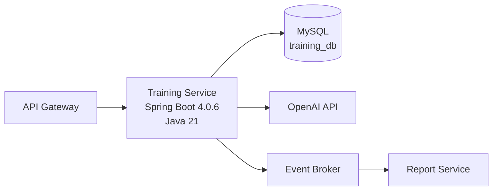

# Training Service Architecture

## 1. Purpose

이 문서는 Training Service를 Spring Boot 기반 서비스로 구현할 때의 아키텍처 기준을 정의한다.

Training Service는 훈련 세션, 훈련 진행 상태, 훈련 로그, 점수, 피드백, 세션 요약을 관리하며 `TrainingCompleted` 이벤트를 발행한다.

이 문서는 구현 파일을 정의하지 않고, 서비스 구조와 책임 경계를 설명한다.

## 2. Runtime Architecture



Training Service는 API Gateway 뒤에 위치한다.

외부 사용자는 Training Service를 직접 호출하지 않고, API Gateway를 통해 `/api/trainings/**` API를 호출한다.

서비스 간 내부 호출은 `/internal/trainings/**` API를 사용한다.

## 3. Docker Composition

Training Service는 Docker로 실행 가능한 독립 컨테이너를 기준으로 설계한다.

기본 Docker 구성은 다음과 같다.

```text
training-service
- Spring Boot 4.0.6 애플리케이션
- Java 21 런타임
- /api/trainings/** API 제공
- /internal/trainings/** API 제공

mysql
- Training Service 전용 MySQL
- database: training_db
- Training Service만 직접 접근
```

OpenAI API, Report Service, Event Broker는 외부 의존성으로 둔다.

로컬 개발 환경에서 필요한 경우 Docker Compose로 함께 묶을 수 있지만, Training Service가 직접 소유하는 데이터베이스는 `training_db`뿐이다.

## 4. Database Architecture

Training Service는 MySQL 기반 `training_db`를 사용한다.

`training_db`는 다음 데이터를 소유한다.

```text
- training_sessions
- social_scenarios
- social_dialog_logs
- user_social_progress
- safety_scenarios
- safety_scenes
- safety_choices
- safety_action_logs
- user_safety_progress
- focus_level_rules
- focus_commands
- focus_reaction_logs
- user_focus_progress
- document_questions
- document_answer_logs
- user_document_progress
- training_scores
- training_feedbacks
- training_session_summaries
```

Training Service는 `user_db`와 `report_db`에 직접 접근하지 않는다.

사용자 식별자는 API Gateway 또는 인증된 컨텍스트에서 전달된 `userId`를 사용한다. Training Service는 `sessionId`가 현재 `userId`의 세션인지 항상 검증한다.

## 5. Spring Application Architecture

기술 기준은 다음과 같다.

```text
Language: Java 21
Framework: Spring Boot 4.0.6
Database: MySQL
Database ownership: training_db
Package root: com.jangchwisa.trainingservice
```

Spring 애플리케이션은 controller, dto, entity, repository, service 책임을 명확히 분리한다.

컨트롤러는 HTTP 요청과 응답 변환만 담당하고, 훈련 완료 처리, 점수 저장, 피드백 저장, 진행 상태 갱신, 이벤트 발행 같은 업무 규칙은 service 계층에서 처리한다.

외부 연동은 `external` 패키지에 adapter 형태로 격리한다.

## 6. Package Structure

```text
com.jangchwisa.trainingservice
├── common
│   ├── exception
│   ├── response
│   ├── security
│   └── validation
├── config
├── training
│   ├── session
│   │   ├── entity
│   │   ├── repository
│   │   └── service
│   ├── social
│   │   ├── controller
│   │   ├── dto
│   │   ├── entity
│   │   ├── repository
│   │   └── service
│   ├── safety
│   │   ├── controller
│   │   ├── dto
│   │   ├── entity
│   │   ├── repository
│   │   └── service
│   ├── focus
│   │   ├── controller
│   │   ├── dto
│   │   ├── entity
│   │   ├── repository
│   │   └── service
│   ├── document
│   │   ├── controller
│   │   ├── dto
│   │   ├── entity
│   │   ├── repository
│   │   └── service
│   ├── progress
│   │   ├── controller
│   │   ├── dto
│   │   └── service
│   ├── score
│   │   ├── entity
│   │   ├── repository
│   │   └── service
│   ├── feedback
│   │   ├── entity
│   │   ├── repository
│   │   └── service
│   └── summary
│       ├── entity
│       ├── repository
│       └── service
├── event
│   ├── dto
│   ├── publisher
│   └── outbox
├── external
│   └── openai
└── support
    └── time
```

### common

공통 예외, API 응답 형식, 사용자 인증 컨텍스트, 요청 검증을 담당한다.

`common.security`는 로그인이나 회원가입을 구현하지 않는다. API Gateway 또는 인증된 컨텍스트에서 전달된 사용자 식별자를 Training Service 내부에서 사용할 수 있게 변환하는 책임만 가진다.

### config

Spring Boot 설정, 데이터베이스 설정, 외부 연동 설정, 이벤트 발행 설정을 담당한다.

### training

Training Service의 핵심 업무 도메인을 포함한다.

`session`은 모든 훈련 유형이 공유하는 세션 생명주기를 관리한다.

`social`, `safety`, `focus`, `document`는 각 훈련 유형별 API, DTO, 엔티티, 저장소, 서비스를 가진다.

`progress`는 사용자별 훈련 진행 상태 조회와 갱신을 담당한다.

`score`, `feedback`, `summary`는 훈련 완료 후 저장되는 결과 데이터를 담당한다.

### event

Training Service가 발행하는 이벤트를 담당한다.

주요 이벤트는 `TrainingCompleted`이다.

이벤트 발행 실패에 대비해 outbox 패키지를 둔다.

### external

Training Service 외부 시스템과의 연동을 담당한다.

`external.openai`는 훈련 평가, 점수 생성, 피드백 생성을 위한 OpenAI API 연동을 담당한다.

### support

업무 도메인에 직접 속하지 않는 기술 보조 기능을 둔다.

`support.time`은 현재 시간 생성, 테스트 가능한 clock 처리 등을 담당한다.

## 7. Boundary Rules

Training Service는 다음 API만 소유한다.

```text
/api/trainings/**
/internal/trainings/**
```

Training Service는 다음 책임을 구현하지 않는다.

```text
- 로그인
- 회원가입
- 사용자 프로필 관리
- STT
- TTS
- 실시간 음성 대화 처리
- 리포트 집계
- 리포트 해석
- 프론트엔드 렌더링
```

훈련 완료 처리는 다음 순서를 기준으로 한다.

```text
1. 원본 로그 또는 결과 저장
2. 점수 저장
3. 피드백 저장
4. 사용자 진행 상태 갱신
5. 훈련 세션 요약 생성
6. 세션 완료 처리
7. TrainingCompleted 이벤트 발행
```
