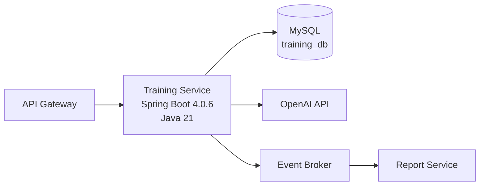

# Training Service Architecture

## 1. Purpose

??臾몄꽌??Training Service瑜?Spring Boot 湲곕컲 ?쒕퉬?ㅻ줈 援ы쁽???뚯쓽 ?꾪궎?띿쿂 湲곗????뺤쓽?쒕떎.

Training Service???덈젴 ?몄뀡, ?덈젴 吏꾪뻾 ?곹깭, ?덈젴 濡쒓렇, ?먯닔, ?쇰뱶諛? ?몄뀡 ?붿빟??愿€由ы븯硫?`TrainingCompleted` ?대깽?몃? 諛쒗뻾?쒕떎.

??臾몄꽌??援ы쁽 ?뚯씪???뺤쓽?섏? ?딄퀬, ?쒕퉬??援ъ“?€ 梨낆엫 寃쎄퀎瑜??ㅻ챸?쒕떎.

## 2. Runtime Architecture



Training Service??API Gateway ?ㅼ뿉 ?꾩튂?쒕떎.

?몃? ?ъ슜?먮뒗 Training Service瑜?吏곸젒 ?몄텧?섏? ?딄퀬, API Gateway瑜??듯빐 `/api/trainings/**` API瑜??몄텧?쒕떎.

?쒕퉬??媛??대? ?몄텧?€ `/internal/trainings/**` API瑜??ъ슜?쒕떎.

## 3. Docker Composition

Training Service??Docker濡??ㅽ뻾 媛€?ν븳 ?낅┰ 而⑦뀒?대꼫瑜?湲곗??쇰줈 ?ㅺ퀎?쒕떎.

湲곕낯 Docker 援ъ꽦?€ ?ㅼ쓬怨?媛숇떎.

```text
training-service
- Spring Boot 4.0.6 ?좏뵆由ъ??댁뀡
- Java 21 ?고???
- /api/trainings/** API ?쒓났
- /internal/trainings/** API ?쒓났

mysql
- Training Service ?꾩슜 MySQL
- database: training_db
- Training Service留?吏곸젒 ?묎렐
```

OpenAI API, Report Service, Event Broker???몃? ?섏〈?깆쑝濡??붾떎.

濡쒖뺄 媛쒕컻 ?섍꼍?먯꽌 ?꾩슂??寃쎌슦 Docker Compose濡??④퍡 臾띠쓣 ???덉?留? Training Service媛€ 吏곸젒 ?뚯쑀?섎뒗 ?곗씠?곕쿋?댁뒪??`training_db`肉먯씠??

## 4. Database Architecture

Training Service??MySQL 湲곕컲 `training_db`瑜??ъ슜?쒕떎.

`training_db`???ㅼ쓬 ?곗씠?곕? ?뚯쑀?쒕떎.

```text
- training_sessions
- social_scenarios
- social_dialog_logs
- user_social_progress
- safety_scenarios
- safety_scenes
- safety_choices
- safety_action_logs
- user_safety_progress
- focus_level_rules
- focus_commands
- focus_reaction_logs
- user_focus_progress
- document_questions
- document_answer_logs
- user_document_progress
- training_scores
- training_feedbacks
- training_session_summaries
```


?ъ슜???앸퀎?먮뒗 API Gateway ?먮뒗 ?몄쬆??而⑦뀓?ㅽ듃?먯꽌 ?꾨떖??`userId`瑜??ъ슜?쒕떎. Training Service??`sessionId`媛€ ?꾩옱 `userId`???몄뀡?몄? ??긽 寃€利앺븳??

## 5. Spring Application Architecture

湲곗닠 湲곗??€ ?ㅼ쓬怨?媛숇떎.

```text
Language: Java 21
Framework: Spring Boot 4.0.6
Database: MySQL
Database ownership: training_db
Package root: com.didgo.trainingservice
```

Spring ?좏뵆由ъ??댁뀡?€ controller, dto, entity, repository, service 梨낆엫??紐낇솗??遺꾨━?쒕떎.

而⑦듃濡ㅻ윭??HTTP ?붿껌怨??묐떟 蹂€?섎쭔 ?대떦?섍퀬, ?덈젴 ?꾨즺 泥섎━, ?먯닔 ?€?? ?쇰뱶諛??€?? 吏꾪뻾 ?곹깭 媛깆떊, ?대깽??諛쒗뻾 媛숈? ?낅Т 洹쒖튃?€ service 怨꾩링?먯꽌 泥섎━?쒕떎.

?몃? ?곕룞?€ `external` ?⑦궎吏€??adapter ?뺥깭濡?寃⑸━?쒕떎.

## 6. Package Structure

```text
com.didgo.trainingservice
?쒋??€ common
??  ?쒋??€ exception
??  ?쒋??€ response
??  ?쒋??€ security
??  ?붴??€ validation
?쒋??€ config
?쒋??€ training
??  ?쒋??€ session
??  ??  ?쒋??€ entity
??  ??  ?쒋??€ repository
??  ??  ?붴??€ service
??  ?쒋??€ social
??  ??  ?쒋??€ controller
??  ??  ?쒋??€ dto
??  ??  ?쒋??€ entity
??  ??  ?쒋??€ repository
??  ??  ?붴??€ service
??  ?쒋??€ safety
??  ??  ?쒋??€ controller
??  ??  ?쒋??€ dto
??  ??  ?쒋??€ entity
??  ??  ?쒋??€ repository
??  ??  ?붴??€ service
??  ?쒋??€ focus
??  ??  ?쒋??€ controller
??  ??  ?쒋??€ dto
??  ??  ?쒋??€ entity
??  ??  ?쒋??€ repository
??  ??  ?붴??€ service
??  ?쒋??€ document
??  ??  ?쒋??€ controller
??  ??  ?쒋??€ dto
??  ??  ?쒋??€ entity
??  ??  ?쒋??€ repository
??  ??  ?붴??€ service
??  ?쒋??€ progress
??  ??  ?쒋??€ controller
??  ??  ?쒋??€ dto
??  ??  ?붴??€ service
??  ?쒋??€ score
??  ??  ?쒋??€ entity
??  ??  ?쒋??€ repository
??  ??  ?붴??€ service
??  ?쒋??€ feedback
??  ??  ?쒋??€ entity
??  ??  ?쒋??€ repository
??  ??  ?붴??€ service
??  ?붴??€ summary
??      ?쒋??€ entity
??      ?쒋??€ repository
??      ?붴??€ service
?쒋??€ event
??  ?쒋??€ dto
??  ?쒋??€ publisher
??  ?붴??€ outbox
?쒋??€ external
??  ?붴??€ openai
?붴??€ support
    ?붴??€ time
```

### common

怨듯넻 ?덉쇅, API ?묐떟 ?뺤떇, ?ъ슜???몄쬆 而⑦뀓?ㅽ듃, ?붿껌 寃€利앹쓣 ?대떦?쒕떎.

`common.security`??濡쒓렇?몄씠???뚯썝媛€?낆쓣 援ы쁽?섏? ?딅뒗?? API Gateway ?먮뒗 ?몄쬆??而⑦뀓?ㅽ듃?먯꽌 ?꾨떖???ъ슜???앸퀎?먮? Training Service ?대??먯꽌 ?ъ슜?????덇쾶 蹂€?섑븯??梨낆엫留?媛€吏꾨떎.

### config

Spring Boot ?ㅼ젙, ?곗씠?곕쿋?댁뒪 ?ㅼ젙, ?몃? ?곕룞 ?ㅼ젙, ?대깽??諛쒗뻾 ?ㅼ젙???대떦?쒕떎.

### training

Training Service???듭떖 ?낅Т ?꾨찓?몄쓣 ?ы븿?쒕떎.

`session`?€ 紐⑤뱺 ?덈젴 ?좏삎??怨듭쑀?섎뒗 ?몄뀡 ?앸챸二쇨린瑜?愿€由ы븳??

`social`, `safety`, `focus`, `document`??媛??덈젴 ?좏삎蹂?API, DTO, ?뷀떚?? ?€?μ냼, ?쒕퉬?ㅻ? 媛€吏꾨떎.

`progress`???ъ슜?먮퀎 ?덈젴 吏꾪뻾 ?곹깭 議고쉶?€ 媛깆떊???대떦?쒕떎.

`score`, `feedback`, `summary`???덈젴 ?꾨즺 ???€?λ릺??寃곌낵 ?곗씠?곕? ?대떦?쒕떎.

### event

Training Service媛€ 諛쒗뻾?섎뒗 ?대깽?몃? ?대떦?쒕떎.

二쇱슂 ?대깽?몃뒗 `TrainingCompleted`?대떎.

?대깽??諛쒗뻾 ?ㅽ뙣???€鍮꾪빐 outbox ?⑦궎吏€瑜??붾떎.

### external

Training Service ?몃? ?쒖뒪?쒓낵???곕룞???대떦?쒕떎.

`external.openai`???덈젴 ?됯?, ?먯닔 ?앹꽦, ?쇰뱶諛??앹꽦???꾪븳 OpenAI API ?곕룞???대떦?쒕떎.

### support

?낅Т ?꾨찓?몄뿉 吏곸젒 ?랁븯吏€ ?딅뒗 湲곗닠 蹂댁“ 湲곕뒫???붾떎.

`support.time`?€ ?꾩옱 ?쒓컙 ?앹꽦, ?뚯뒪??媛€?ν븳 clock 泥섎━ ?깆쓣 ?대떦?쒕떎.

## 7. Boundary Rules

Training Service???ㅼ쓬 API留??뚯쑀?쒕떎.

```text
/api/trainings/**
/internal/trainings/**
```

Training Service???ㅼ쓬 梨낆엫??援ы쁽?섏? ?딅뒗??

```text
- 濡쒓렇??
- ?뚯썝媛€??
- ?ъ슜???꾨줈??愿€由?
- STT
- TTS
- ?ㅼ떆媛??뚯꽦 ?€??泥섎━
- 由ы룷??吏묎퀎
- 由ы룷???댁꽍
- ?꾨줎?몄뿏???뚮뜑留?
```

?덈젴 ?꾨즺 泥섎━???ㅼ쓬 ?쒖꽌瑜?湲곗??쇰줈 ?쒕떎.

```text
1. ?먮낯 濡쒓렇 ?먮뒗 寃곌낵 ?€??
2. ?먯닔 ?€??
3. ?쇰뱶諛??€??
4. ?ъ슜??吏꾪뻾 ?곹깭 媛깆떊
5. ?덈젴 ?몄뀡 ?붿빟 ?앹꽦
6. ?몄뀡 ?꾨즺 泥섎━
7. TrainingCompleted ?대깽??諛쒗뻾
```

